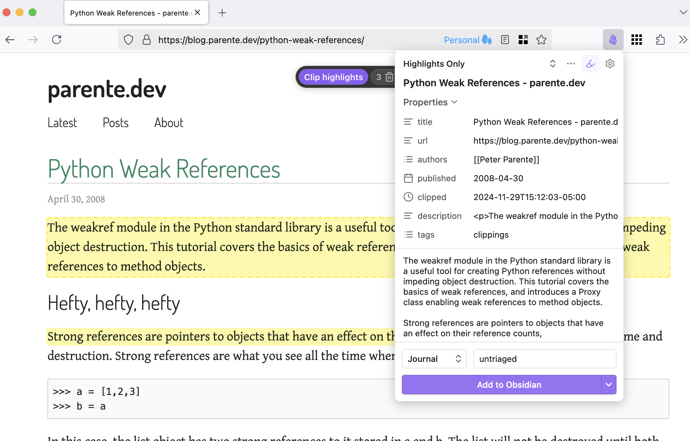
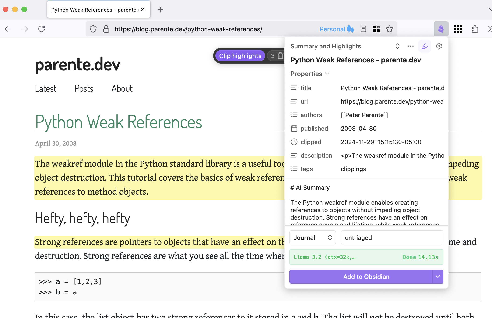
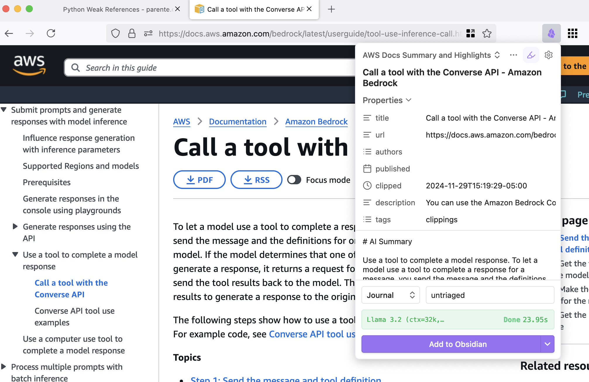

I use [Obsidian](https://obsidian.md) to capture information like my daily todo lists; notes about things I've read, listened to, watched, or done; reminders about repeating chores and home maintenance tasks; trips I'm planning or places I've visited--anything and everything.

I recently learned about the [Obsidian web clipper](https://github.com/obsidianmd/obsidian-clipper) browser extension. I was intrigued by some of the features [shown on the landing page](https://obsidian.md/clipper). I started thinking about how it might improve my workflows for indexing web pages that I want to go back and read in more detail and distilling them into notes for quick reference later. Instead of manually entering all of the page metadata, copy/pasting text from the page into a note, and writing a quick summary, maybe the extension could take a first pass for me.

I set out to get the [web clipper Firefox extension](https://addons.mozilla.org/en-US/firefox/addon/web-clipper-obsidian/) configured on my Mac, with a local [Meta Llama 3.2](https://ollama.com/library/llama3.2) model set as an [interpreter](https://help.obsidian.md/web-clipper/interpreter) to summarize content in some of my [templates](https://help.obsidian.md/web-clipper/templates). The [Obsidian help pages](https://help.obsidian.md/web-clipper) explained the basics. I wrote this post to describe the steps I took from top-to-bottom, including what I did to get summaries of acceptable quality in my clippings.[^1]

# Prereqs

I started with the following:

- Macbook Pro M2 w/ 16 GB RAM
- macOS Sequoia 15.x
- [homebrew](https://brew.sh)
- [Firefox](https://www.mozilla.org/en-US/firefox/) (`brew install --cask firefox`)
- [Obsidian](https://obsidian.md) >=1.7.2 (`brew install --cask obsidian`)

# Page Highlights

I installed the extension and created an initial template to store page highlights in Obsidian notes by following the steps below.

1. Install the Obsidian web clipper extension from [the Firefox add-ons
   site](https://addons.mozilla.org/en-US/firefox/addon/web-clipper-obsidian/).
2. Click the Obsidian icon in the Firefox toolbar and then click the gear to open the settings screen.
3. Add my primary vault named `Journal` to the _Vaults_ list.
4. Create a _New Template_ named `Highlights Only` which saves to the `untriaged` folder in my `Journal` vault and has _Note content_ `{{highlights|map: item => item.text|join:"\n\n"}}` (i.e., the text of all my highlights separated by newlines).
5. Update the _Properties_ in the template to align with ones I already use on my Obsidian notes (e.g., `url` instead of `source`, `clipped` instead of `created` with an ISO-8601 datetime).
6. Delete the _Default_ template.
7. Click _Properties_ in the sidebar and then _Remove unused properties_ so only the metadata I care about are listed.

At this point, I was able to open the extension, click the highlighter icon, select portions of the page, and save notes containing my manual highlights.



# Page Summaries

I created a second template that includes a generated page summary in addition to my highlights by taking these steps.

## Create an ollama model for summarization

1. Install the Ollama macOS desktop app and CLI with `brew install --cask ollama`.
2. Run `launchctl setenv OLLAMA_ORIGINS 'moz-extension://*'` so that the local Ollama server will accept connections from my Firefox browser.[^2]
3. Run the Ollama macOS app from the finder and work through the setup dialog screens until they disappear.[^3]
4. Create a `Modelfile` with the following content.

```
# Use the 3B parameter, 2 GB base model file
FROM llama3.2
# Larger context window for page summaries
PARAMETER num_ctx 32768
# Lower temperature for more conservative sampling / less creative summaries
PARAMETER temperature 0.25
```

5. Run `ollama create -f Modelfile llama3.2:ctx32k-t0.25` to create a model config with that ID.
6. Run `ollama list` and confirm the base and custom models exist.

## Enable the model as an interpreter

1. Click the Obsidian icon in the Firefox toolbar and then click the gear to open the settings screen again.
2. Click _Interpreter_ and enable it.
3. Click _Add provider_ and enter details about the local Ollama server.
    - _Provider_: `Ollama`
    - _Base URL_: `http://127.0.0.1:11434/api/chat`
    - _API key_: `ollama`
4. Click _Add model_ and enter details about the local Ollama server.
    - _Provider_: `Ollama`
    - _Display name_: `Llama 3.2 (ctx=32k, t=0.25)`
    - _Model ID_: `llama3.2:ctx32k-t0.25` (the ID used when running `ollama create` earlier)

## Create a new template

1. Click the _Highlights Only_ template created earlier.
2. Click _More -> Duplicate_ at the top.
3. Name the new template _Summary and Highlights_.
4. Update the _Note content_ to include a prompt variable.

```markdown
# AI Summary

{{"Generate a concise, 5 sentence summary of the content within the prior <documentPrefix></documentPrefix> tags."|strip_tags}}

# Highlights

{{highlights|map: item => item.text|join:"\n\n"}}
```

5. Update the _Interpreter context_ to include a slice of the page content smaller than the context window configured for the model.

```markdown
<documentPrefix>{{content|slice:0,16384}}</documentPrefix>
```

After these additional steps, I was able to select the `Summary and Highlights` template in the extension popup, select the `Llama 3.2 (ctx=32k, t=0.25)` interpreter, click _Interpret_ to get a preview of generated summary, and save notes containing both the summary and my manual highlights.



# Site-Specific Templates

I found that my generic _Summary and Highlights_ template did not work on all sites. The `{{content}}` variable, for instance, only contains text about cookies on AWS documentation pages. I created a [template selected automatically](https://help.obsidian.md/web-clipper/templates#Automatically+trigger+a+template) for the AWS docs site by following the steps below.

1. Visit the extension settings again.
2. Click the _Summary and Highlights_ template created earlier.
3. Click _More -> Duplicate_ at the top.
4. Name the new template _AWS Docs Summary and Highlights_.
5. Put `https://docs.aws.amazon.com/` in the _Template triggers_ textbox.
6. Update the _Note content_ with a slightly customized prompt.

```markdown
# AI Summary

{{"Generate a concise, 5 sentence summary of the AWS docs content within the prior <documentPrefix></documentPrefix> tags."|strip_tags}}

# Highlights

{{highlights|map: item => item.text|join:"\n\n"}}
```

7. Update the _Interpreter context_ to pull content from the HTML element with `id="main"` instead of [where the extension gets it by default](https://help.obsidian.md/web-clipper/troubleshoot#Some+content+is+missing).

```markdown
<documentPrefix>{{selectorHtml:#main|markdown|slice:0,16384}}</documentPrefix>
```

I was able to visit one of the [Amazon Bedrock documentation pages](https://docs.aws.amazon.com/bedrock/latest/userguide/tool-use-inference-call.html) and generate a meaningful summary after configuring this template for automatic activation on the https://docs.aws.amazon.com site.



# Final Thoughts

- The web clipper extension is in beta as of this writing. I expect the UX will change.
- There are a lot of knobs to turn here, from model parameters to prompt variables to note formats to template configs. Tuning and tweaking is in order.
- The OpenAI and Anthropic models would likely provide better results out of the gate. I'm sticking with Ollama/Llama in the spirit of the local-only Obsidian privacy model.

---

[^1]: I'm maintaining my latest Obsidian configs in [parente/obsidian-configs on GitHub](https://github.com/parente/obsidian-configs).
[^2]: I did spend a few moments considering if I should set this env var less globally and narrow down the extension UUID(s) allowed. I did not think it worth the effort in my case. Follow your heart.
[^3]: Restart the Ollama app from the macOS menu bar if you're already running it so that the `launchctl setenv` takes effect. Otherwise, the ollama server will respond with auth errors when the extension attempts to use it.
