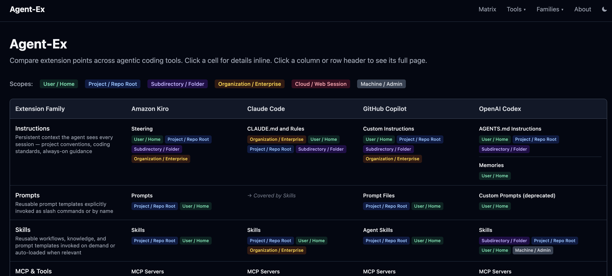

I wanted a way to compare extension points across AI coding tools. So I
[prompted](https://github.com/parente/agent-ex/blob/main/docs/000-chatgpt-deep-research-chat.md)
ChatGPT Deep Research to compare Codex, Copilot, Claude, and Kiro.

The [resulting
report](https://github.com/parente/agent-ex/blob/main/docs/001-chatgpt-deep-research-report.md) was
pretty dense. So I worked with Kiro to
[plan](https://github.com/parente/agent-ex/blob/main/docs/002-kiro-web-app-plan.md) and
[implement](https://github.com/parente/agent-ex/tree/main) a [web app](https://agent-ex.pages.dev)
to make exploration a bit easier.

I wondered how I might keep the info in this web app up-to-date over time. So I worked with Kiro
again to
[plan](https://github.com/parente/agent-ex/blob/main/docs/003-kiro-research-update-process-plan.md)
and build a
[skill](https://github.com/parente/agent-ex/blob/main/.kiro/skills/update-vendor-data/SKILL.md) for
crawling vendor docs and a scheduled
[workflow](https://github.com/parente/agent-ex/blob/main/.github/workflows/update-vendor-data.yml)
for proposing updates.

I don't know if this little experiment will maintain something useful or turn to gibberish. I'm
genuinely interested in finding out. 🍿
